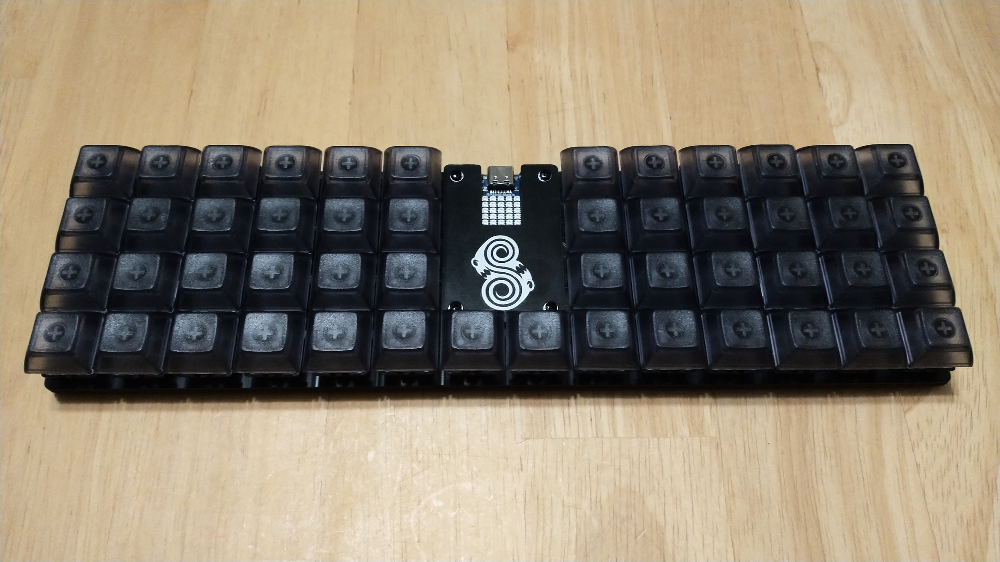
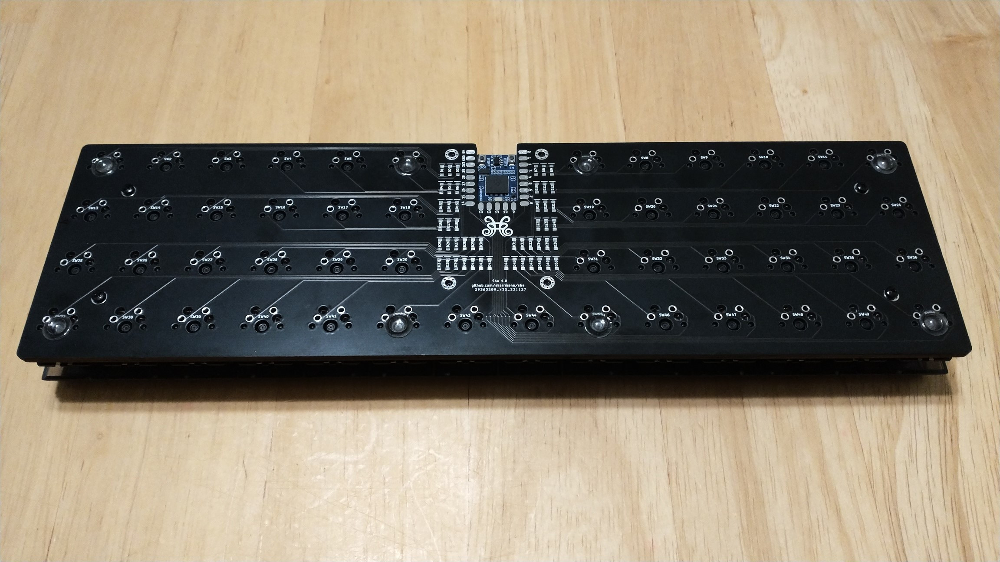
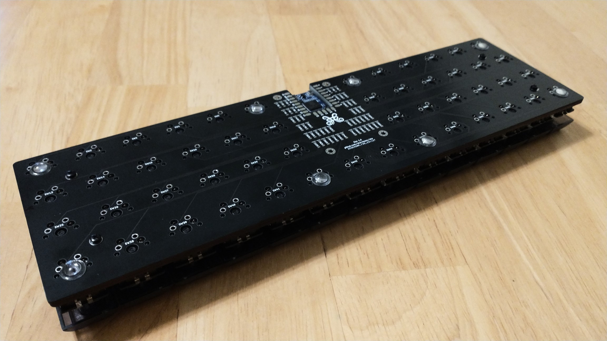
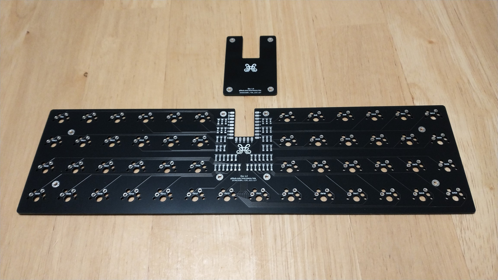
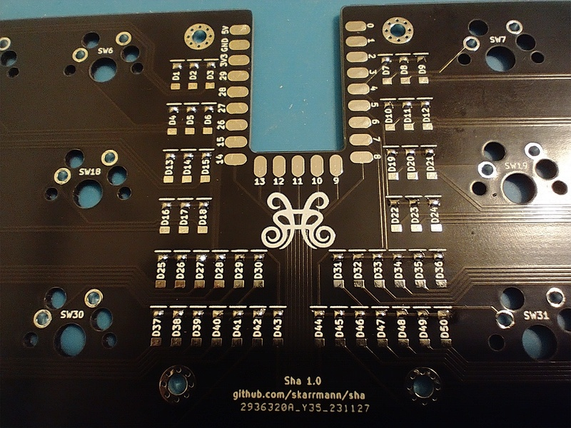
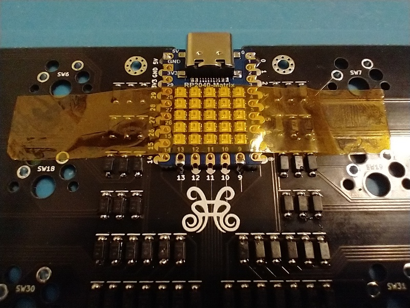
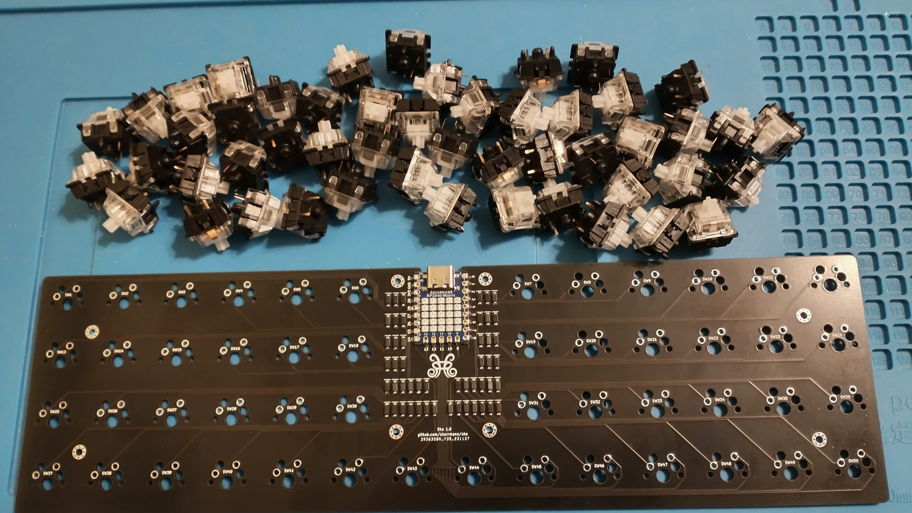
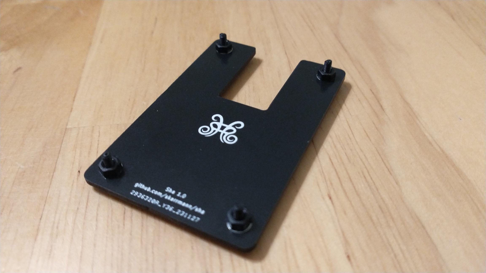
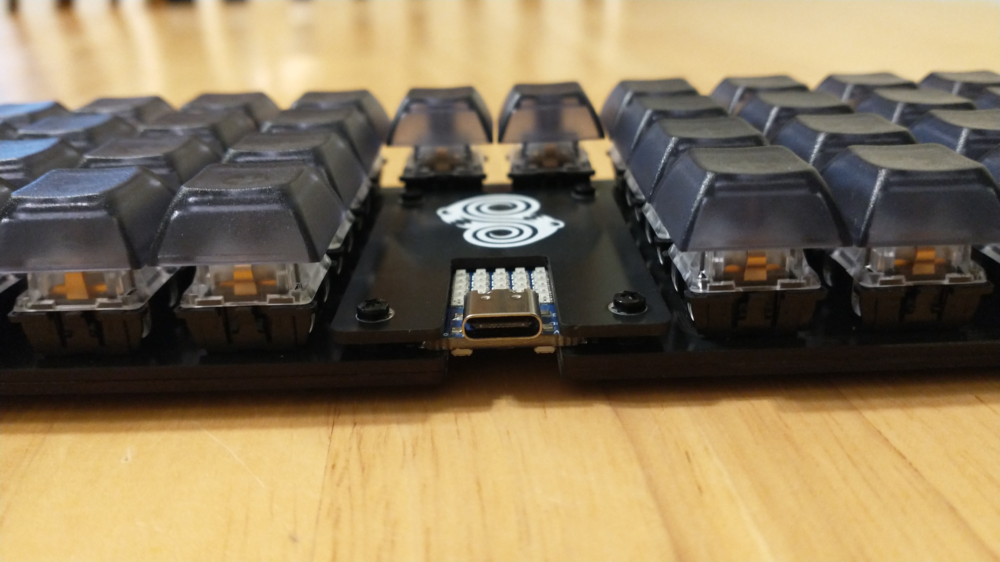

# Sha Keyboard

Sha is a 50 key ortholinear keyboard, powered by either a Waveshare RP2040-Zero or RP2040-Matrix.

## Project structure

* [`gerbers`](gerbers): Gerber files for PCB manufacturing
* [`graphics`](graphics): Source assets for PCB silkscreen
* [`kicad`](kicad): KiCad project files (schematics and PCB designs)
* [`kicad-libraries`](kicad-libraries): KiCad components and footprints
* [`images`](images): Images for project documentation
* [`firmware`](firmware): Firmware files

## PCBs

The PCB is designed for MX switches.

The Waveshare RP2040-Zero/Matrix footprint uses surface-mount solder pads. The castellated pads of the MCU board are soldered directly onto the PCB.

**Each build uses two copies of the main PCB**. This PCB acts as both the logical PCB, and when flipped the long way, it acts as a bottom plate to be attached the logical PCB.

An optional top plate PCB is available in the gerber files. This top plate covers the diodes and the solder pads of the MCU board.

## Keyboard firmware

* KMK
    * Setup instructions and basic configuration is in this repo: [`firmware/kmk`](firmware/kmk)

## Bill of materials

Part | Purpose | Quantity | Notes
---- | ------- | -------- | -----
Main PCB  | circuit board and bottom plate | 2 | Send Gerber zip files to [JLCPCB](https://jlcpcb.com/)
Top plate PCB | protects diodes and MCU board | 1 |
Waveshare RP2040-Zero | Microcontroller board | 1 | Also supports Waveshare RP2040-Matrix
1N4148 SOD-123 | Diodes for keyboard row-column matrix | 50 |
Keyswitches |  | 50 | PCB mount (5 pin) switches recommended
Keycaps |  | 50
M2 6mm screws | 4 to secure main PCB and bottom plate PCB, 4 for top plate | 8 |
M2 nuts | 4 to secure main PCB and bottom plate PCB, 4 as spacers for top plate | 8 |
2mm tall rubber bumpons | Raise board above desk surface and provide skid resitance | 8 | 

Note the 4 M2 6mm screws and 4 M2 nuts just "friction fit" the top plate. To fully screw in the top plate, You could use 4 M2 10mm+ screws and 4 more M2 nuts. I meant to do this, but acc

## PCB manufacturing settings

These are the manufacturing settings I used when ordering from JLCPCB:

* **Base Material**: FR4
* **Layers**: 2
* **Dimensions**: (whatever the gerber file specifies)
* **PCB Qty**: 5
* **Different Design**: 1
* **Delivery Format**: Single PCB
* **PCB Thickness**: 1.6
* **PCB Color**: Black
* **Silkscreen**: White
* **Surface Finish**: LeadFree HASL-RoHS
* **Outer Copper Weight**: 1 oz
* **Gold Fingers**: No
* **Confirm Production File**: No
* **Flying Probe Test**: Fully Test
* **Castellated Holes**: No
* **Remove Order Number**: Specify a location

**IMPORTANT:** The PCB has ["JLCJLCJLCJLC" silkscreen text](https://jlcpcb.com/help/article/50-How-to-remove-order-number-from-your-PCB) on top side of the board. If you want to remove the order number from the boards or you want to print the PCBs with another manufacturer, then I recommend removing this silkscreen text from the `.kicad_pcb` file, and then regenerate the Gerber files.

## Build tips

* Solder the diodes first. Tin one side of all the diode solder pads, and then position each diode and re-heat this tinned pad to tack the diode in place. Then solder the other diode leg on each diode.
     * 
* Once the diodes are fully soldered, do the microcontroller board next. Tape the board into position, and then solder the corner pads to tack it into place. Remove the tape and solder the remaining microcontroller board pads.
     * 
* Last, solder in the switches. Note the switch PCB mounting pin holes were loose on my PCBs, but this might have been a manufacturing anomaly since I've never encountered this issue in other builds using this footprint. I worked around this by placing keycaps on the switches, then first soldering the four corner switches while applying pressure on top of the switch so it's fully inserted. Then I placed all the switches in their slots, pressed a spare PCB on top of the switches in a sandwich, flipped the board over, and soldered one leg of each switch while applying pressure to fully insert the switches. After confirming the switches were fully inserted, I soldered the other leg on each switch.
     * 
* For attaching the plates, use a single screw and hex nut to secure the bottom plate PCB to the main PCB. For the top plate, I just put a 6mm screw and hex through this plate's holes. The screw threads rest inside the PCB mounting holes, giving it a fiction fit. You could use other hardware to permanently screw in the top plate. See the BOM notes for suggestions.
     * 
     * 

## KiCad project notes

The top plate was generated with the [Horizon Board Producer KiCad plugin](https://github.com/skarrmann/horizon#kicad-project-notes).

## Revision history

* **Sha 1.0** (2023-11-26)
     * Initial PCB design